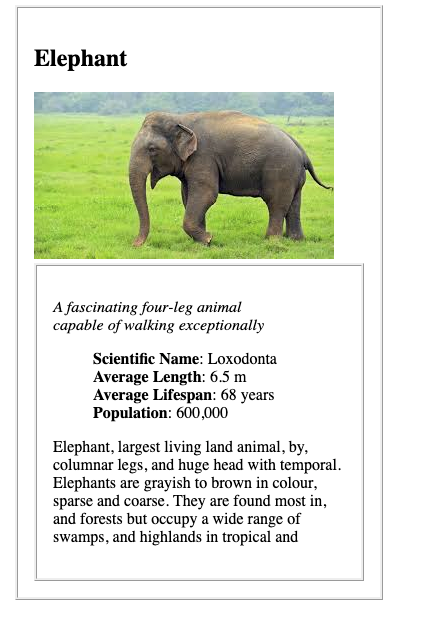
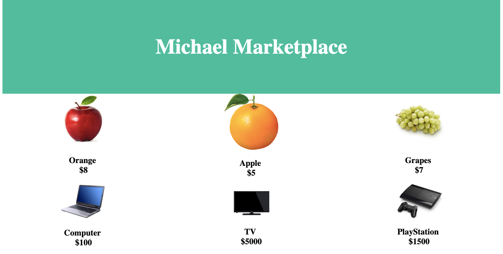

# Front End Mini Project
Mini projects made using HTML, CSS, and Javascript 

# Project List 

1. Animal Card - A card designed with HTML & CSS providing information about an animal 

2. Button - A CSS button that changes color upon a hover 

3. Cat Clicker - A Cat-click application, the user can select which cat they would like to click. In addition, there is an admin mode allowing the user to modify details in the cat. The project uses the Model, Octopus, view seperation method where each class is it's own object. 

4. Grocery - An example grocery website created with HTML & CSS

5. Mockup to article: Recreating a blog post wrriten By Christopher Watkins and rewriting it using HTML 

6. Testing: Following an Udacity lesson and designing an adressbook & implementing tests in Javascript  

7. Resume - Initial attempt to recreate LinkedIn profile using HTML & CSS, ended up extending and creating a detail portfolio [here](https://github.com/MichaelGitHubHype/Personal_Portfolio)

